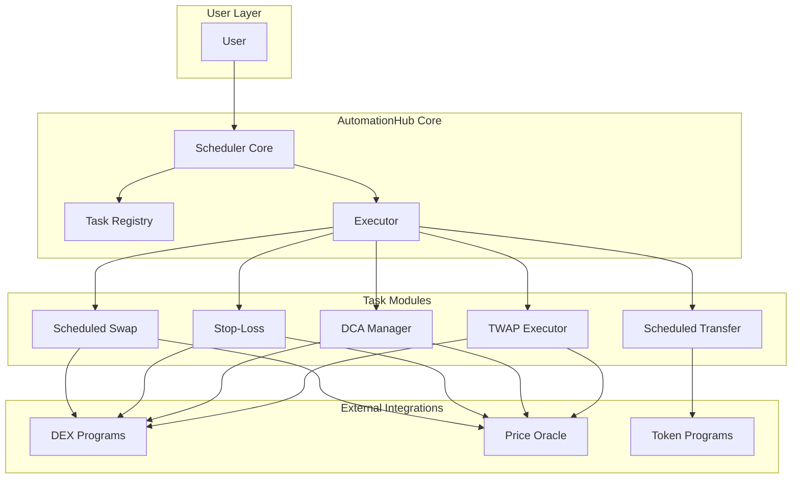
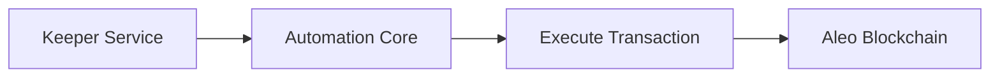

# Aleo Onchain Automation Layer - Architecture Design

## UPDATED: Authorization-Based Automation (SDK Pattern)

Based on the Aleo SDK authorization pattern:
1. User builds authorization with private key (includes ZK proof)
2. User sends authorization string to keeper (NO private key needed!)
3. Keeper stores and executes at trigger time
4. Amounts/recipients stay private - keeper never sees them

---

## Hybrid Trigger Model (Your Input)

| Component | Visibility | Example |
|----------|-----------|---------|
| **Trigger** | Public | Time (block height) or Price |
| **Action** | Private | Amount, recipient |

The keeper only needs to know WHEN to execute - not WHAT the action contains.

---

## CRITICAL: Aleo Privacy Model

**States are private by default on Aleo!** 
- Use **`record`** for private data (owned by addresses)
- Use **`mapping`** for public data (accessible by anyone)
- The Token Registry uses both: `record Token` (private) + `mapping balances` (public)

**Key Pattern from auction.aleo:**
```leo
record Bid {
    owner: address,
    bidder: address,
    amount: u64,
    is_winner: bool,
}

transition place_bid(bidder: address, amount: u64) -> Bid {
    // Private data encapsulated in record
    return Bid { owner: ..., bidder: ..., amount: ..., is_winner: false };
}
```

---

## Project Overview

**Project Name:** AleoAutomationHub  
**Purpose:** Onchain automation for DeFi operations including scheduled transfers, swaps, stop-loss, DCA, and TWAP  
**Target Users:** DeFi traders and investors who want automated, trustless execution

---

## 1. Architecture Decision: Modular Approach

### Recommendation: Connected Modular Contracts

Rather than a single monolithic contract, use **interconnected modules** that each handle specific functionality:



### Why Modular?

| Benefit | Explanation |
|---------|-------------|
| **Separation of Concerns** | Each task type has unique logic; keeping them separate simplifies maintenance |
| **Upgradeability** | Fix or enhance one module without affecting others |
| **Gas Efficiency** | Users only pay for the features they use |
| **Composability** | Can reuse modules in other projects |
| **Learning Curve** | Easier to build and understand incrementally |

---

## 2. Core Components

### 2.1 Key Insight: Records vs Mappings

| What | Use | Why |
|------|-----|-----|
| Task parameters (amounts, addresses) | **`record`** | Private until execution - protects user privacy |
| Task existence/status (ready to execute) | **`mapping`** | Public so keepers can find ready tasks |
| Execution history | **`mapping`** | Public for transparency |

### 2.2 Scheduler Core - AUTHORIZATION-BASED APPROACH

**NEW PATTERN:** Using SDK authorization instead of public mappings.

**How It Works:**
1. User pre-generates authorization using their private key (off-chain)
2. User sends authorization string to keeper (amount hidden)
3. Keeper stores authorization and waits for trigger
4. When trigger fires, keeper executes using stored authorization

**Key Benefits:**
- Amount/recipient NEVER exposed until execution
- Keeper never sees private key
- No public mapping reveals user positions
- User can pre-generate multiple authorizations for recurring tasks

**Data Structures:**
```leo
// PUBLIC mapping - just triggers, no sensitive data
mapping automation_tasks: field => AutomationTrigger;

// Private record - user owns, contains authorization metadata (not amounts)
record AutomationConfig {
    owner: address,
    task_id: field,
    trigger_type: u8,      // 0=time, 1=price_above, 2=price_below
    trigger_value: field,   // block_height or price_hash (actual price onchain)
    is_active: bool,
    executions_remaining: u32,
}

struct AutomationTrigger {
    task_id: field,
    trigger_block: u32,    // When this becomes executable
    trigger_type: u8,       // time or price condition
    is_executed: bool,      // Prevent double execution
}
```

**Flow:**
1. User creates `AutomationConfig` with trigger conditions
2. User pre-generates authorization for the action (transfer/swap/etc)
3. Keeper stores authorization, monitors `automation_tasks` mapping
4. When trigger block reached, keeper calls execute with stored authorization
5. Program verifies trigger, executes action, updates state

### 2.2 Task Registry (`task_registry.aleo`)

Stores task-specific configuration and state.

**Responsibilities:**
- Store task parameters (amounts, addresses, conditions)
- Track execution history
- Manage task-specific state (e.g., DCA cumulative amounts)

**Mappings:**
- `transfer_tasks: field => TransferTask`
- `swap_tasks: field => SwapTask`
- `dca_tasks: field => DCATask`
- `twap_tasks: field => TWAPTask`
- `execution_log: field => ExecutionLog[]`

### 2.3 Executor Module - AUTHORIZATION EXECUTION

**Using SDK Authorization Pattern:**

```typescript
// === USER SIDE (Creates Authorization) ===
const authorization = await programManager.buildAuthorization({
    programName: "automation_executor.aleo",
    functionName: "execute_transfer",
    privateKey: userPrivateKey,  // Only user has this!
    inputs: ["amount_hidden_in_proof", "recipient_hidden"],
});

// Send to keeper - NO PRIVATE KEY needed
await keeperAPI.registerTask({
    userId: user.id,
    authorization: authorization.toString(),
    trigger: { type: "time", value: "2026-04-01T14:00:00Z" }
});

// === KEEPER SIDE (Executes Later) ===
async function executeWhenDue() {
    const storedAuth = Authorization.fromString(task.authorization);
    
    // Verify trigger condition onchain
    const currentBlock = await network.getLatestBlockHeight();
    if (currentBlock >= task.triggerBlock) {
        const tx = await programManager.buildTransactionFromAuthorization({
            authorization: storedAuth,
        });
        await broadcast(tx);
    }
}
```

**Key Point:** Keeper never sees amounts or private key - only the authorization string.

---

## 3. Task Modules - AUTHORIZATION PATTERN

### 3.1 Scheduled Transfer (`scheduled_transfer.aleo`)

**Privacy Model:**
- **Private:** Amount, recipient (in authorization)
- **Public:** Trigger time, task existence

**How It Works:**
```leo
// Public mapping - just triggers
mapping automation_triggers: field => TriggerInfo;

// Execute function - takes authorization
transition execute_transfer(
    public task_id: field,
    // Authorization contains: amount, recipient (hidden)
) -> Future {
    // Verify trigger conditions
    let trigger: TriggerInfo = Mapping::get(automation_triggers, task_id);
    assert(block.height >= trigger.trigger_block);
    
    // Execute transfer using authorized amounts
    return finalize_execute_transfer(task_id);
}

async function finalize_execute_transfer(task_id: field) {
    // Transfer tokens - amounts come from authorization proof
    // Not from any mapping!
}
```

**User Flow:**
1. User calls `transfer_public` via SDK, gets authorization string
2. User sends to keeper with trigger time
3. Keeper monitors trigger mapping
4. At trigger time, keeper executes with stored authorization

### 3.2 Scheduled Swap (`scheduled_swap.aleo`)

**Use Cases:**
- Swap tokens at specific times
- Take profit at target price
- Token conversion automation

**Parameters:**
```leo
struct SwapTask {
    task_id: field,
    from_token: field,
    to_token: field,
    amount_in: u128,
    min_amount_out: u128,
    dex_program: address,  // Which DEX to use
}
```

### 3.3 Stop-Loss (`stop_loss.aleo`)

**Key Insight:** Use the same anti-hunting pattern from the orderbook!

**Use Cases:**
- Auto-sell when price drops to threshold
- Protect against market crashes

**Parameters:**
```leo
struct StopLossTask {
    task_id: field,
    token_pair: u64,       // Trading pair
    amount: u128,
    stop_price_hash: field, // HASH of stop price (privacy!)
    dex_program: address,
    triggered: bool,
    is_buy: bool,          // false = sell, true = buy (for buy-stop)
}
```

**Pattern from Orderbook:**
- Store stop price as [`field`](private_orderbook_0000v8testnet.aleo:76) (commitment/hash)
- Keeper provides actual price + proof to trigger
- Prevents liquidation hunting

### 3.4 DCA Manager (`dca_manager.aleo`)

**Dollar Cost Averaging:** Buy/sell fixed amounts at regular intervals

**Parameters:**
```leo
struct DCATask {
    task_id: field,
    from_token: field,
    to_token: field,
    amount_per_swap: u128,
    interval_blocks: u32,
    total_swaps: u32,
    completed_swaps: u32,
    next_execution: u32,
    dex_program: address,
    active: bool,
}
```

**Flow:**
1. User funds DCA with total amount (e.g., 1000 USDC for 10 swaps of 100 each)
2. Each interval, keeper executes one swap
3. Track completed swaps vs total
4. Auto-pause when complete

### 3.5 TWAP Executor (`twap_executor.aleo`)

**Time-Weighted Average Price:** Split large orders into smaller chunks to get better average price

**Parameters:**
```leo
struct TWAPTask {
    task_id: field,
    from_token: field,
    to_token: field,
    total_amount: u128,
    chunk_size: u128,
    interval_blocks: u32,
    chunks_executed: u32,
    start_block: u32,
    dex_program: address,
}
```

---

## 4. Price Oracle Integration

The system needs price data for stop-loss, DCA price limits, and TWAP.

### Option A: Oracle Program
```leo
// Simple price oracle (could be_chainlink-style or AMM-based)
mapping prices: u64 => u128;  // token_pair_id => price
```

### Option B: AMM-Based (No Oracle Needed)
- Use DEX reserves to calculate price
- More decentralized but can be manipulated
- TWAP-based price smoothing

### Recommendation: Start with AMM-based, add oracle later

---

## 5. Keeper Network

Aleo doesn't have automatic cron jobs - we need external keepers.

### Keeper Architecture


### Keeper Incentives
- Earn execution fees from each task
- Priority queue for faster execution (MEV-like)
- Bond/collateral to prevent spam

### Keeper Functions
```leo
// Anyone can be a keeper if they have executor role
async transition execute_task(
    public task_id: field
) -> Future
```

---

## 6. Data Flow Summary

### Creating a Task
```
User → create_task() → Funds escrowed → Task registered in mapping → Scheduler tracks
```

### Executing a Task
```
Scheduler (block height reached) → Keeper picks up task → 
validate_conditions() → execute_action() → 
Update task state → Reward keeper
```

### Recurring Tasks
```
After execution → If recurring and not exhausted → 
Calculate next block → Update scheduler → Wait
```

---

## 7. Implementation Order

### Phase 1: Core Infrastructure
1. `automation_core.aleo` - Scheduler and task management
2. Basic keeper role and executor

### Phase 2: Basic Features
3. `scheduled_transfer.aleo` - Simple time-based transfers
4. `scheduled_swap.aleo` - Basic swap execution

### Phase 3: Advanced Features
5. `stop_loss.aleo` - With privacy-preserving triggers
6. `dca_manager.aleo` - Dollar cost averaging

### Phase 4: Professional Features
7. `twap_executor.aleo` - Large order splitting
8. Price oracle integration

### Phase 5: Polish
- Frontend dashboard
- Gas optimization
- Keeper network

---

## 8. Shared State & Connections

### How Modules Connect

| Connection | Mechanism |
|-----------|-----------|
| Scheduler → Tasks | `tasks` mapping in core, task-specific mappings in registry |
| Keeper → Execution | `execute_task()` in executor, calls task-specific functions |
| Tasks → External | Direct calls to `token_registry.aleo`, `credits.aleo`, DEX programs |

### Integration with Existing Programs

Based on the orderbook example, we can call:
```leo
// Token transfers
credits.aleo/transfer_public(recipient, amount)
token_registry.aleo/transfer_public(token_id, recipient, amount)

// DEX swaps (depends on DEX interface)
dex_program/swap(token_in, token_out, amount_in, min_out)

// Price data
oracle_program/get_price(token_pair)
```

---

---

## 10. The Core Challenge: Record Ownership + Keeper Execution

**Problem:** User owns private record, but keeper needs to execute it. How?

### Solution: Hybrid + Your 3-Function Pattern

Each task module follows this interface:

```leo
// 1. CHECK STATUS - Public, keeper calls to find ready tasks
transition check_status(task_id: field) -> bool

// 2. CREATE - User calls to create task  
transition create_task(params...) -> (Receipt, Future)

// 3. EXECUTE - Keeper calls when check_status returns true
transition execute(task: TaskRecord, keeper: address) -> (Receipt, Future)
```

### Architecture Choice: Public Mappings for Execution

Given Aleo's constraints, use **public mappings** for task data that keepers must access:

```leo
// Public mapping - keeper can read to find ready tasks
mapping tasks: field => TaskData {
    owner: address,        // Public (keeper needs to verify)
    token_id: field,      // Public (for token transfer)
    amount: u128,         // Public (keeper needs this)
    next_execution: u32,  // Public (to check if ready)
    status: u8,           // Public
}

// Private record - proof of ownership, for receipts
record TaskReceipt {
    owner: address,
    task_id: field,
    created_at: u32,
}
```

### Flow with Your Pattern:

```
┌──────────┐     ┌─────────────────┐     ┌─────────────┐
│  Keeper  │────▶│ check_status()  │     │   Public    │
│          │     │ returns: true   │     │  Mapping    │
└──────────┘     └────────┬────────┘     │  (tasks)    │
                          │              └──────┬──────┘
                          ▼                     │
                    ┌───────────────┐           │
                    │ execute()     │◀──────────┘
                    │ passes task   │
                    └───────┬───────┘
                            ▼
                    ┌───────────────┐     ┌─────────────┐
                    │ token transfer│────▶│   Token     │
                    │ via registry  │     │  Registry   │
                    └───────────────┘     └─────────────┘
```

### Why This Works:

1. **check_status** is public → keeper can scan for ready tasks
2. **Task data in mapping** → keeper can access needed info
3. **Private receipts** → user has proof of their tasks
4. **Simple pattern** → each module has exactly 3 functions

---

## 11. Summary: Final Architecture

| Component | Approach |
|-----------|----------|
| **Task Storage** | Public mappings (for keeper access) |
| **Proof/Receipts** | Private records |
| **Each Module** | 3 functions: create, check_status, execute |
| **Keeper** | Scans public mappings, calls execute when ready |
| **Privacy** | Partial - amounts visible but execution is automated |

This solves the core challenge while keeping automation possible!
